# Informações do Projeto
`Locação de veículos`  

......  Locação de Veículos ......

`CURSO` 

Projeto desenvolvido para a disciplina de Trabalho Interdisciplinar: Aplicações para Processos de Negócios do curso de Análise e desenvolvimento de sistemas da Pontifícia Universidade Católica de Minas Gerais.

## Participantes

> Os membros do grupo são: 
> - Lucas Laboissiere Ferreira
> - Marcos Rocha Simões Araujo
> - Rafael Ricardo de Oliveira Goulart
> - Vitor Carvalho Soares de Paula

# Estrutura do Documento

- [Informações do Projeto](#informações-do-projeto)
  - [Participantes](#participantes)
- [Estrutura do Documento](#estrutura-do-documento)
- [Introdução](#introdução)
  - [Problema](#problema)
  - [Objetivos](#objetivos)
  - [Justificativa](#justificativa)
  - [Público-Alvo](#público-alvo)
- [Especificações do Projeto](#especificações-do-projeto)
  - [Personas e Mapas de Empatia](#personas-e-mapas-de-empatia)
  - [Histórias de Usuários](#histórias-de-usuários)
  - [Requisitos](#requisitos)
    - [Requisitos Funcionais](#requisitos-funcionais)
    - [Requisitos não Funcionais](#requisitos-não-funcionais)
  - [Restrições](#restrições)
- [Projeto de Interface](#projeto-de-interface)
  - [User Flow](#user-flow)
  - [Wireframes](#wireframes)
- [Metodologia](#metodologia)
  - [Divisão de Papéis](#divisão-de-papéis)
  - [Ferramentas](#ferramentas)
  - [Controle de Versão](#controle-de-versão)
- [**############## SPRINT 1 ACABA AQUI #############**](#-sprint-1-acaba-aqui-)
- [Projeto da Solução](#projeto-da-solução)
  - [Tecnologias Utilizadas](#tecnologias-utilizadas)
  - [Arquitetura da solução](#arquitetura-da-solução)
- [Avaliação da Aplicação](#avaliação-da-aplicação)
  - [Plano de Testes](#plano-de-testes)
  - [Ferramentas de Testes (Opcional)](#ferramentas-de-testes-opcional)
  - [Registros de Testes](#registros-de-testes)
- [Referências](#referências)

# Introdução

## Problema

O problema central que essa aplicação busca resolver é a simplificação do processo de aluguel. Com a aplicação, os usuários podem buscar, reservar e alugar veículos de forma rápida e prática, o que torna o processo de locação de carros mais fácil, acessível e seguro.

## Objetivos

O objetivo geral do trabalho é desenvolver um software para solucionar o problema de gerenciamento de locação de carros. O software permitirá que os usuários aluguem carros por um determinado período de tempo, enquanto a empresa de locação de carros gerencia seus veículos e clientes de forma eficiente.

Para alcançar esse objetivo geral, é possível estabelecer os seguintes objetivos específicos:

1 - Desenvolver um sistema de gerenciamento de estoque: O software deve permitir que a empresa de locação de carros gerencie seu estoque de veículos de forma eficiente, monitorando o status de cada carro, disponibilidade, manutenção e histórico de locações anteriores. Isso permitirá que a empresa tome decisões informadas sobre quando adquirir novos veículos, quando retirar veículos antigos e quando programar a manutenção preventiva.

2 - Criar um sistema de reservas online: O software deve permitir que os usuários reservem carros online, escolhendo o modelo e a data de início e término da locação. O sistema deve calcular automaticamente o valor da locação com base no modelo do carro escolhido, duração da locação e outras taxas aplicáveis. Isso simplificará o processo de reserva para o usuário e permitirá que a empresa gerencie melhor suas reservas, reduzindo o risco de reservas duplicadas ou conflitantes.

## Justificativa

A aplicação de locação de carros é importante porque oferece aos clientes uma alternativa de transporte flexível e acessível, sem a necessidade de possuir um veículo próprio. Além disso, é um serviço muito utilizado por viajantes e turistas, o que torna a aplicação uma opção interessante para o setor de turismo e mobilidade urbana.

No que diz respeito aos objetivos específicos, o sistema de gerenciamento de estoque é importante porque permite que a empresa de locação de carros gerencie seus veículos de forma eficiente, garantindo que seus veículos estejam sempre em boas condições de funcionamento e prontos para serem alugados. Além disso, o monitoramento do histórico de locações anteriores permite que a empresa identifique quais veículos são mais populares e possam ser adquiridos em maior quantidade.

Já o sistema de reservas online é importante porque permite que os clientes reservem carros com antecedência e facilidade, o que aumenta a eficiência do processo de locação e reduz o risco de erros ou conflitos nas reservas. Além disso, com o sistema de reservas online, a empresa pode gerenciar melhor sua capacidade de oferta e demanda, e planejar seus estoques de veículos de acordo com a procura.

Em geral, a motivação para trabalhar nesta aplicação vem da necessidade de fornecer um serviço mais eficiente, conveniente e acessível para os clientes que precisam de um meio de transporte temporário. Além disso, o gerenciamento eficiente dos veículos e das reservas pode ajudar a empresa a melhorar seus lucros e expandir seu negócio.

## Público-Alvo

Podemos identificar um público-alvo em potencial, que são pessoas e empresas que buscam um serviço de aluguel de carros de forma fácil, prática e segura. Este público-alvo pode incluir homens e mulheres de diferentes idades, incluindo jovens adultos (entre 18 e 30 anos), adultos (entre 31 e 50 anos) e idosos (acima de 50 anos).

A aplicação web de locação de veículos pode atender a diferentes necessidades desse público-alvo. Viajantes a lazer ou a negócios podem encontrar facilmente um carro para se locomover durante sua estadia, enquanto residentes urbanos podem alugar um carro para necessidades diárias, como compras ou transporte para o trabalho. Empresas de transporte também podem se beneficiar da facilidade de alugar veículos para fins comerciais.

Para atender às necessidades desse público-alvo, a aplicação web de locação de veículos deve ser projetada e desenvolvida de forma a oferecer uma experiência de uso amigável e intuitiva, com funcionalidades que permitam ao usuário pesquisar e reservar carros de forma rápida e eficiente. Além disso, a aplicação deve garantir a segurança e privacidade dos dados do usuário, com o cumprimento das leis e regulamentações de proteção de dados, como a Lei Geral de Proteção de Dados (LGPD) no Brasil.

 
# Especificações do Projeto

Para o projeto de desenvolvimento da aplicação de locação de carros, será utilizada uma abordagem simples, com foco na especificação de requisitos e na definição da arquitetura do software. Para isso, serão utilizadas técnicas e ferramentas comuns em projetos de desenvolvimento de software, como análise de requisitos, especificação de casos de uso, modelagem de dados, prototipagem, diagramas de arquitetura e uma metodologia ágil de desenvolvimento. O objetivo é garantir que a solução atenda às necessidades dos usuários e seja desenvolvida de forma eficiente e eficaz.

## Personas e Mapas de Empatia

......  
Persona 1 - Cliente Pessoa Física:

Nome: Ana

Descrição: Ana é uma mulher de 30 anos que mora na cidade e precisa de um carro para se locomover com frequência. Ela prefere carros compactos e econômicos e não quer gastar muito dinheiro com combustível. Ana não tem conhecimentos avançados em tecnologia, mas usa smartphones e aplicativos com frequência.

Mapa de Empatia da Persona 1 - Cliente Pessoa Física:

|O que a persona vê?      |	       O que a persona ouve?  |    O que a persona pensa e sente?    |       O que a persona diz e faz?           |
|-------------------------|-----------------------------------|--------------------------------------|--------------------------------------------|
|Dificuldades de locomoção|Comentários de amigos e familiares |	Quer economizar e gastar pouco com  combustível |Pesquisa carros compactos e econômicos.     |
|Anúncios em aplicativos e redes socias              | Sugestões de amigos               | Precisa de um carro para se locomover|   Usa aplicativos para comparar preços     |
|Opções variadas de locadoras|  Propagandas em meios de comunicação|Tem medo de ser enganada ou ter problemas| Verifica as avaliações das locadoras|
|Opiniões de outros usuários   | Comentários sobre o mercado de locação de carros | Deseja praticidade e agilidade| Realiza a reserva pelo aplicativo |

                

Persona 2 - Cliente Pessoa Jurídica:

Nome: João

Descrição: João é um empresário de 46 anos que administra uma pequena empresa de entregas na cidade. Ele precisa alugar carros para a sua equipe realizar as entregas, e prefere carros mais espaçosos e robustos. João tem conhecimentos básicos em tecnologia e costuma usar aplicativos de gestão empresarial em seu trabalho.

Mapa de Empatia da Persona 2 - Cliente Pessoa Jurídica:

|O que a persona vê?      |	       O que a persona ouve?      |    O que a persona pensa e sente?    |       O que a persona diz e faz?           |
|-------------------------|-----------------------------------|--------------------------------------|--------------------------------------------| 
|Dificuldades de transporte para a equipe|	Comentários de colegas empresários|	Necessidade de alugar carros regularmente|Verifica preços e promoções das locadoras   |
|Propagandas em meios de comunicação  | Sugestões de amigos            | Deseja carros espaçosos e robustos   |   Faz a reserva pelo aplicativo    |
|Opções variadas de locadoras |  Comentários sobre o mercado de locação de carros |Precisa de nota fiscal para reembolso |   Verifica a possibilidade de faturamento em nome da empresa |
|Condições de pagamento   | Comentários de outros usuários    |  Deseja agilidade no processo de reserva |    Realiza a reserva com antecedência  |

Persona 3 - Motorista de aplicativos:

Nome: Felipe

Descrição: Felipe é um jovem de 22 anos que trabalha como motorista de aplicativos em tempo integral. Ele não tem carro próprio e precisa alugar um veículo para trabalhar. Felipe busca um carro econômico e confortável para dirigir por longas horas, além de um preço acessível para poder ter uma renda satisfatória. Ele tem conhecimentos avançados em tecnologia e está sempre buscando ferramentas e aplicativos para otimizar o seu trabalho.

Mapa de Empatia da Persona 3 - Motorista de aplicativos:

|O que a persona vê?      |	       O que a persona ouve?      |    O que a persona pensa e sente?    |       O que a persona diz e faz?           |
|----------------------------|--------------------------------------|--------------------------------------|--------------------------------------------|
|Necessidade de alugar um carro |Sujestões de outros motoristas|Quer um carro econômico e confortável|Procura por aplicativos e locadoras com melhores preços|
|Anúncios em aplicativos e redes sociais | Comentários sobre o mercado de locação de carros |Precisa de um preço acessível para ter uma renda satisfatória|  Verifica as condições de pagamento|
|Variedade de opções de locadoras|  Dificuldade em encontrar um bom negócio|Deseja ter um carro disponível a qualquer hora| Reserva um carro com antecedência para garantir a disponibilidade|
|Opiniões de outros motoristas| Comentários sobre a qualidade dos carros |Deseja ter um bom suporte em caso de problemas |Verifica os canais de atendimento das locadoras|

			 ......

## Histórias de Usuários

Com base na análise das personas forma identificadas as seguintes histórias de usuários:

|EU COMO... `PERSONA`| QUERO/PRECISO ... `FUNCIONALIDADE` |PARA ... `MOTIVO/VALOR`                 |
|--------------------|------------------------------------|----------------------------------------|
|cliente  | fazer uma reserva de carro com antecedência           | garantir a disponibilidade do carro na data e hora desejadas             |
|usuário   | criar e gerenciar uma conta | possa acessar minhas reservas anteriores e armazenar minhas informações pessoais e de pagamento com segurança |
|usuário | cancelar minha reserva, caso haja necessidade | evitar cobranças indevidas|
|usuário| pesquisar os carros disponíveis para aluguel | escolher o modelo que melhor atenda às minhas necessidades|

## Requisitos

As tabelas que se seguem apresentam os requisitos funcionais e não funcionais que detalham o escopo do projeto.

### Requisitos Funcionais

|ID    | Descrição do Requisito  | Prioridade |
|------|-----------------------------------------|----|
|RF-001| Sistema de reserva de veículos | ALTA | 
|RF-002| Pagamento online seguro  | ALTA |
|RF-003| Calendário de disponibilidade de veículos  | ALTA |
|RF-004| Filtro de pesquisa  | ALTA |
|RF-005| Sistema de cadastro de clientes | MÉDIA |
|RF-006| Avaliações e comentários dos clientes | BAIXA |
|RF-007| Sistema de atendimento ao cliente | BAIXA |

### Requisitos não Funcionais

|ID     | Descrição do Requisito  |Prioridade |
|-------|-------------------------|----|
|RNF-001| Segurança | ALTA | 
|RNF-002| Velocidade |  MÉDIA | 
|RNF-003| Usabilidade |  ALTA | 
|RNF-004| Confiabilidade |  MÉDIA | 
|RNF-005| Escalabilidade |  BAIXA | 
|RNF-006| Compatibilidade | ALTA |
|RNF-007| Manutenibilidade | MÉDIA |

## Restrições

O projeto está restrito pelos itens apresentados na tabela a seguir.

|ID| Restrição                                             |
|--|-------------------------------------------------------|
|01| Restrição Legal: O site deve estar em conformidade com as leis e regulamentações locais e nacionais de locação de veículos, incluindo requisitos para documentação, seguro e segurança veicular. |
|02| Regulamentações de privacidade de dados: Para garantir a conformidade com o RGPD, a aplicação deve implementar uma política de privacidade clara e concisa, que explique aos usuários como seus dados pessoais serão coletados, armazenados e usados. |

# Projeto de Interface

O projeto de criação de site de locação de veículos exigirá uma interface amigável, intuitiva e fácil de usar para os usuários, que permita a reserva e a busca de veículos disponíveis, bem como a visualização de informações importantes, como preços, horários e datas.

Para atender a esses requisitos, o site será dividido em duas principais interfaces: a interface de busca e reserva de veículos, a interface de gerenciamento de conta do usuário.

A interface de busca e reserva de veículos terá um formulário de pesquisa que permitirá aos usuários pesquisar veículos disponíveis com base em diferentes critérios, como localização, datas de reserva e tipo de veículo. A interface também permitirá aos usuários ver fotos dos veículos disponíveis, informações sobre preços, horários e outras informações relevantes, como políticas de seguro.
A interface de gerenciamento de conta do usuário permitirá aos usuários acessar e gerenciar suas informações pessoais, como nome, endereço e informações de pagamento, bem como visualizar o histórico de reservas e transações anteriores.

## User Flow

......  INCLUA AQUI O DIAGRAMA COM O FLUXO DO USUÁRIO NA APLICAÇÃO ......

> Fluxo de usuário (User Flow) é uma técnica que permite ao desenvolvedor
> mapear todo fluxo de telas do site ou app. Essa técnica funciona
> para alinhar os caminhos e as possíveis ações que o usuário pode
> fazer junto com os membros de sua equipe.
>
> **Links Úteis**:
> - [User Flow: O Quê É e Como Fazer?](https://medium.com/7bits/fluxo-de-usu%C3%A1rio-user-flow-o-que-%C3%A9-como-fazer-79d965872534)
> - [User Flow vs Site Maps](http://designr.com.br/sitemap-e-user-flow-quais-as-diferencas-e-quando-usar-cada-um/)
> - [Top 25 User Flow Tools & Templates for Smooth](https://www.mockplus.com/blog/post/user-flow-tools)
>
> **Exemplo**:
> 
> 

## Wireframes

Página Inicial:
Nossa home terá uma interface bem intuitiva para o cliente ir direto ao ponto que deseja, reservar um veículo.

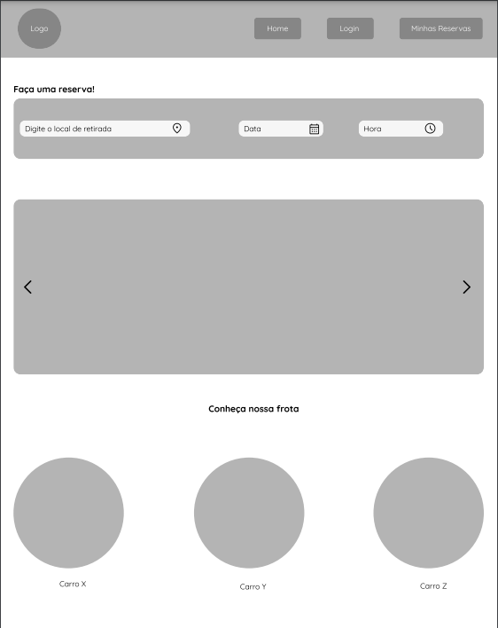

Página de login:
Página de login simples, com a opção de cadastro e esqueci senha.

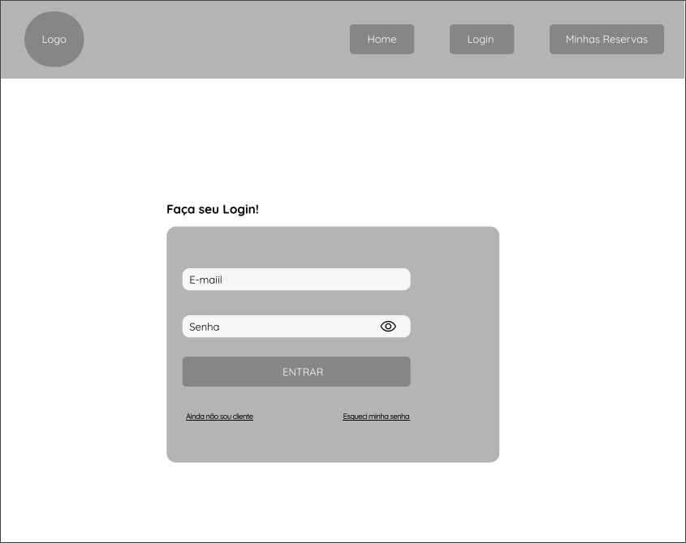

Página de Cadastro:
Página de cadastro, com preenchimento de dados do usuário.

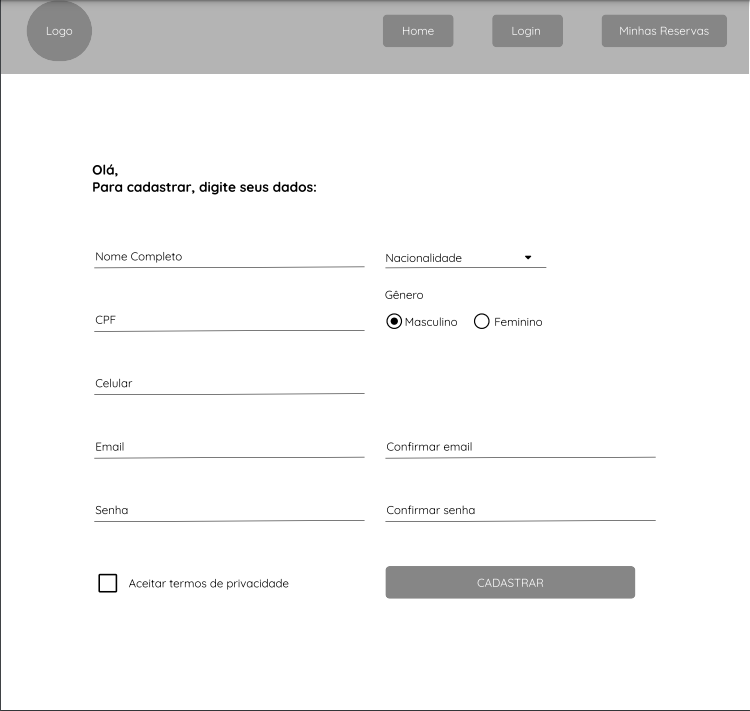

# Metodologia

Durante a execução do projeto, o grupo adotou metodologias ágeis para orientar o processo de trabalho. Essa abordagem permitiu uma maior flexibilidade na tomada de decisões e adaptação às necessidades do projeto em tempo real. A equipe se dividiu em papéis e tarefas, cada um com suas responsabilidades específicas, para garantir a execução das atividades de maneira organizada e eficiente. 
Para garantir a comunicação fluida entre os membros da equipe, foram utilizadas ferramentas como o Discord e o Trello. O Discord permitiu a troca de mensagens instantâneas, a organização de canais temáticos e a realização de reuniões virtuais. Já o Trello foi utilizado para gerenciar as tarefas, definir prioridades e acompanhar o status de cada atividade. 

A gestão de configuração do projeto foi realizada por meio da plataforma GitHub. Essa ferramenta permitiu o controle das versões do projeto, a colaboração entre os membros da equipe e o rastreamento de bugs.  

Processo Design Thinking 

Montamos um passo a passo a seguir: 

Empatia: Comece com a compreensão das necessidades e perspectivas dos usuários do site, incluindo seus objetivos ao alugar um carro, as dificuldades que enfrentam durante o processo de reserva, suas preferências de pagamento e outros fatores importantes. 

Definição do problema: Com base nas informações coletadas na etapa anterior, defina o problema ou problemas que o site de locação de veículos precisa resolver para melhorar a experiência do usuário e atender às suas necessidades de maneira mais eficaz. 

Ideação: Use técnicas criativas de brainstorming para gerar ideias para melhorar o site de locação de veículos. Considere ideias como tornar o processo de reserva mais fácil e intuitivo, fornecer informações mais detalhadas sobre a frota de veículos disponíveis, oferecer diferentes opções de pagamento, incluindo pacotes de seguro mais completos, entre outras. 

Prototipagem: Com base nas ideias geradas na etapa anterior, crie protótipos de soluções possíveis. Os protótipos podem incluir esboços de telas, modelos em papel, modelos de interface de usuário, etc. 

Teste: Teste os protótipos com usuários reais e obtenha feedback para entender o que funciona e o que não funciona. Use o feedback para iterar e refinar as soluções até chegar a uma solução final que resolva os problemas identificados na etapa de empatia e ofereça uma experiência de usuário excelente. 

Implementação: Depois de finalizar a solução, implemente-a no site de locação de veículos. Monitore os resultados e faça ajustes conforme necessário para garantir que a solução continue atendendo às necessidades dos usuários e melhorando a experiência geral do usuário. ......

## Divisão de Papéis

Rafael Ricardo de Oliveira Goulart: Desenvolvedor Full Stack 

Marcos Rocha Simões Araújo: Scrum Master/Desenvolvedor Full Stack 

Vitor Carvalho Soares de Paula: Desenvolvedor Full Stack .

Lucas Laboissiere Ferreira: Desenvolvedor Full Stack 

## Ferramentas

| Ambiente  | Plataforma              |Link de Acesso |
|-----------|-------------------------|---------------|
|Repositório de código | GitHub |(https://github.com/PSG-TIAPN-2022-1/psg-tiapn-2023-1-locacao-de-veiculos) | 
|Hospedagem do site | GitHub | (ainda não foi postado) | 
|Protótipo Interativo | Figma | (https://www.figma.com/file/xCB3boTCCdGYgvyjzM0oKn/Untitled?node-id=0%3A1&t=b2XOCvu1dZlVSDHk-1) | 
|Editor de código | VScode | sem link | 
|Ferramentas de comunicação | Teams, Discord e WhatsApp | (https://chat.whatsapp.com/JJ8LBqwDElmAgA26f1STNy)| 
|Ferramentas de diagramação| Figma e Trello |(https://trello.com/b/hiCVF8D8/kanban-quadro) | 

> O VScodefoi escolhido porque ele possui uma integração com o
> sistema de versão e é muito amplo em tecnologias. As ferramentas de comunicação utilizadas possuem
> integração semelhante, fora a facilidade de acesso e por isso foram selecionadas. Por fim, para criar
> diagramas utilizamos essas ferramentas por ajudarem na idealização de design e organização de tarefas.
> 

## Controle de Versão

Nosso controle de versão será feito através da extensão do github ao Visual Studio Code para fazermos os commits diretamento ao Github.

# Modelagem do processo de negócio 

Nesta fase, são desenvolvidos modelos que descrevem o fluxo de trabalho atual ou futuro de uma empresa, a fim de entender melhor como as atividades são realizadas e identificar oportunidades para melhorar a eficiência e eficácia do processo.

## Análise da Situação Atual

`Introdução`

Este relatório tem como objetivo apresentar a análise da situação atual da aplicação de locação de veículos, que visa desenvolver um sistema de reserva de veículos para uma empresa de locação. A aplicação está sendo desenvolvida por um grupo de estudantes universitários como projeto de conclusão de curso.

`Metodologia`

A análise foi realizada por meio de reuniões com os membros da equipe, avaliação dos artefatos produzidos até o momento e análise de casos de uso e requisitos levantados. Foi realizada também uma avaliação do mercado de locação de veículos para identificar oportunidades de melhoria e tendências no setor.

`Resultados`

A seguir, serão apresentados os principais resultados da análise:

`Escopo do projeto`

O escopo do projeto foi bem definido e está alinhado com as necessidades do cliente.
A equipe está trabalhando em um sistema de reserva de veículos, que permite ao cliente reservar um veículo por meio de uma plataforma online.

`Tecnologias utilizadas`

A equipe está utilizando tecnologias atuais e modernas para o desenvolvimento da aplicação, como Javascript,html5,css3,Bootstrap5,Microsoft SQL server.
Há uma preocupação em manter a aplicação atualizada e seguindo as melhores práticas de desenvolvimento.

`Dinâmica de trabalho em equipe`

A equipe possui uma boa dinâmica de trabalho em equipe, com boa comunicação e colaboração entre os membros.
Há uma boa distribuição de tarefas e responsabilidades, e cada integrante está ciente do seu papel no projeto.
A equipe se comunica regularmente, seja por meio de reuniões presenciais ou virtuais, a fim de garantir o andamento do projeto.

`Experiência prévia em projetos semelhantes`

A maioria dos membros da equipe possui experiência prévia em projetos de desenvolvimento de software, o que pode contribuir para um desenvolvimento mais eficiente e assertivo.
Alguns membros da equipe possuem conhecimento específico em desenvolvimento web e banco de dados, o que pode ser um diferencial no desenvolvimento da aplicação.

`Oportunidades de melhoria`

Identificou-se a oportunidade de implementação de um sistema de feedback para os usuários, a fim de identificar pontos de melhoria na aplicação.
A análise do mercado identificou a tendência de utilização de inteligência artificial e machine learning na área de locação de veículos, o que pode ser uma oportunidade de expansão da aplicação no futuro.

`Conclusão`

Com base na análise realizada, podemos concluir que a equipe de desenvolvimento da aplicação de locação de veículos possui um bom potencial para o desenvolvimento do sistema. A equipe está trabalhando em um escopo bem definido, utilizando tecnologias atuais e modernas, e com uma boa dinâmica de trabalho em equipe. Além disso, a experiência prévia dos membros da equipe em projetos de desenvolvimento de software pode ser um diferencial no sucesso do projeto. Foram identificadas também oportunidades de melhoria na aplicação e tendências no mercado de locação de veículos que podem ser exploradas no futuro.

## Descrição dos Processos Aprimorados

> Nosso Primeiro diagrama foi baseado no conceito simples da locação
> 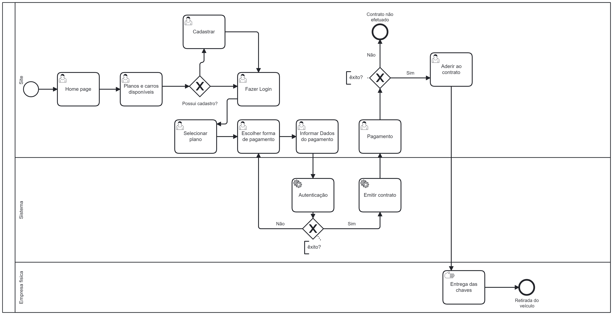

> Nosso segundo diagrama já focamos melhor em toda dificuldade que se poderia ter no processo, em possibilidades do usuário e do sistema durante a nevegação.
> Baseamos agora apenas no processo que nossa aplicação vai realizar, que é simplesmente a Reserva do veículo! Nossa aplicação deve atender esse passo da melhor forma possível.
> 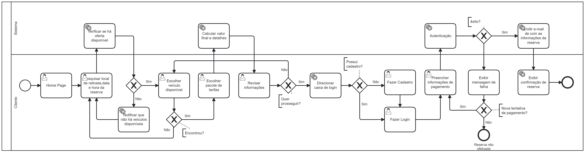
> 

# Modelagem de Dados

Desenvolvemos a modelagem de entidade e relaciona no Camunda desktop.

## Diagrama de Entidade-Relacionamento

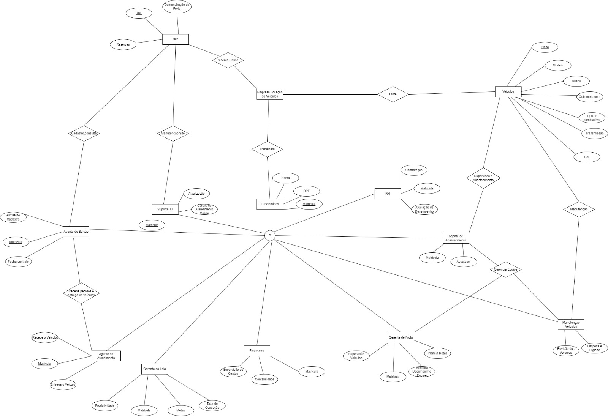

## Modelo Relacional

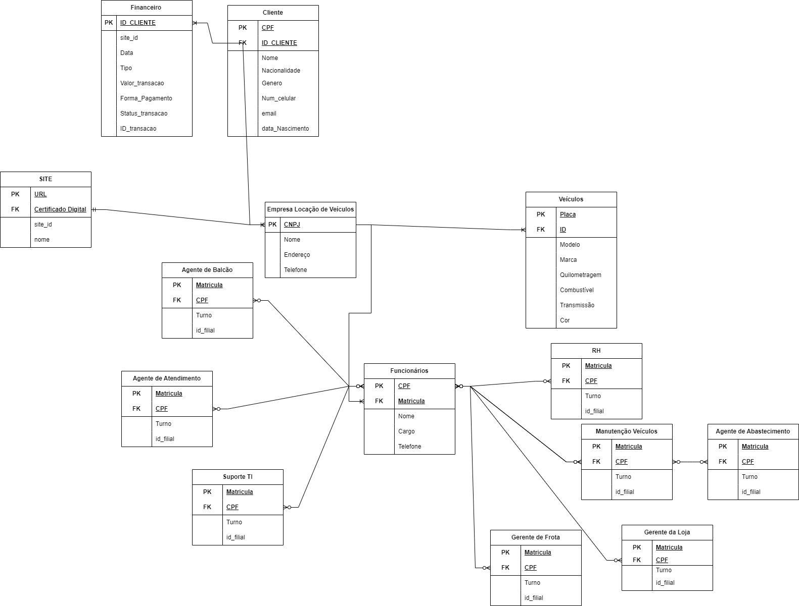

# Papéis associados aos processos
A modelagem de negócios é a etapa em que as regras, restrições e lógicas do negócio são definidas para garantir o funcionamento adequado do sistema. Apesar de um bom trabalho de modelagem, é comum que surjam problemas ou inconsistências nas regras ao longo do tempo devido a mudanças nos requisitos, novos cenários ou erros ocasionais. É nesse contexto que entram os papéis associados ao processo, que consistem nos comandos SQL utilizados para solucionar esses problemas.

##### Cadastrar novo usuario
Ao fazer um cadastro no site o usuário será registrado no banco de dados e deve ter um ID único que será gerado automaticamente no banco de dados. Para essa demanda, utilizamos o seguinte comando SQL: 

`INSERT INTO USUARIOS (NOME_COMPLETO,NACIONALIDADE,CPF,GENERO,CELULAR,EMAIL,SENHA) VALUES (@NOME_COMPLETO,@NACIONALIDADE,@CPF,@GENERO,@CELULAR,@EMAIL,@SENHA)`

##### Exibir véiculos disponíveis 
Ao entrar no site o usuário logo é capaz de buscar veículos disponíveis a partir do local de retirada, data e hora selecionados, para solucionar essa demanda o seguinte comando SQL é utilizado:

`SELECT PLACA,ID,MODELO,MARCA,QUILOMETRAGEM,COMBUSTIVEL,TRANSMISSAO,COR,IMAGEM_LINK,VALOR,ValorSemanal FROM VEICULOS WHERE Cod_empresa = @Cod AND DISPONIVEL = 1`

Ou seja, serão mostrados em uma próxima páginas todos os veículos disponíveis ("DISPONIVEL" tem de ser igual a 1) no local selecionado (Cod_empresa define o código da empresa que aquele veículos está localizado).

##### Reservar e Deixar veículo indisponível 
Após escolher o veículo e ir para a tela de confirmação de locação o usuário confirma a reserva e para isso é necessnecessário deixar aquele carro com o campo "DISPONIVEL" igual a zero, além disso é preciso registrar essa reserva desse usuário, para solucionar essa demanda o seguinte comando SQL é utilizado:

`UPDATE VEICULOS SET DISPONIVEL = 0 WHERE ID = @idVeiculo`

`INSERT INTO RESERVAS (userID, idVeiculo, dataDeReserva, horaDeReserva, numero, rua, cidade, modelo, marca, combustivel, transmissao, cor, quilometragem, valorsemanal, imagem, PLACA) VALUES (@userID, @idVeiculo, @dataDeReserva, @horaDeReserva, @numero, @rua, @cidade, @modelo, @marca, @combustivel, @transmissao, @cor, @quilometragem, @valorsemanal, @imagem, @PLACA`

##### Cancelar reserva e deixar veículo disponível
Da mesma maneira, para cancelar uma reserva é necessário atualizar o carro e deixá-lo disponível novamente, bem como remover esse veículo das reservas daquele usuário. Para essa demanda foi utilizado o seguinte comando SQL:

`UPDATE VEICULOS SET DISPONIVEL = 1 WHERE PLACA = @PLACA`

`DELETE FROM RESERVAS WHERE reservaID = @reservaID`

##### Exibir reservas feitas pelo usuario
Ao confirmar uma reserva o usuário é direcionado à página "Minhas reservas" onde deve ser exibidas todas as reservas feitas por aquele usuário, bem como os detalhes da reserva, como local de retirada e detalhes do carro. Para solucionar essa demanda utilizamos o seguinte comando SQL:

`SELECT reservaID ,userID,dataDeReserva,horaDeReserva,numero ,rua,cidade,modelo,marca,combustivel,transmissao,cor,quilometragem,valorsemanal ,imagem, PLACA FROM RESERVAS WHERE userID = @id`

# Scripts para automatização do processo
1- Um dos scripts de automatização pensado a ser implementado na aplicação teria como função logo após a realização de cadastro no site, o usuário deve receber um e-mail da nossa empresa com a confirmação de cadastro.

2- Outro Script no mesmo sentido, faria o envio automático de um e-mail com todos os detalhes da reserva do veículo logo após a reserva ser confirmada pelo usuário.

3- Uma nova possibilidade de automatização seria comunicar o usuário um ou dois dias antes sobre sua reserva a fim de lembra-lo da mesma, evitando assim eventuais ausências no dia da retirada.

# Relatórios analíticos

Em suma, esse relatório analítico oferece uma visão detalhada sobre os principais gráficos de índices permitindo uma compreensão mais profunda do comportamento dos clientes e fornecendo insights valiosos para aprimorar nossos serviços, melhorar a disponibilidade de veículos e aumentar a satisfação dos clientes.

Apresentaremos os seguintes gráficos:

Esses dados representam uma amostra de reservas feitas no período de junho de 2023. Eles incluem diferentes tipos de carros (econômico, intermediário, SUV) e suas respectivas datas de reserva e preços

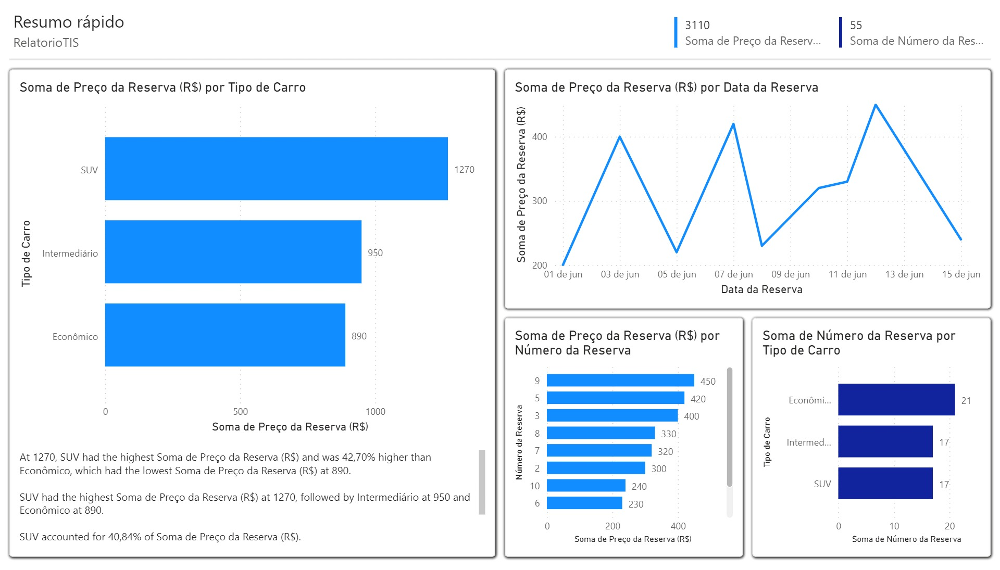

Esse gráfico representa uma amostra de dados de acesso ao site e reservas feitas ao longo de uma semana específica. Os dados incluem a data, o número de visitantes que acessaram o site nesse dia e o número de reservas feitas nesse mesmo período. Esses dados podem ser utilizados para análises posteriores, como calcular a taxa de conversão de visitantes em reservas ou identificar padrões de comportamento dos usuários.

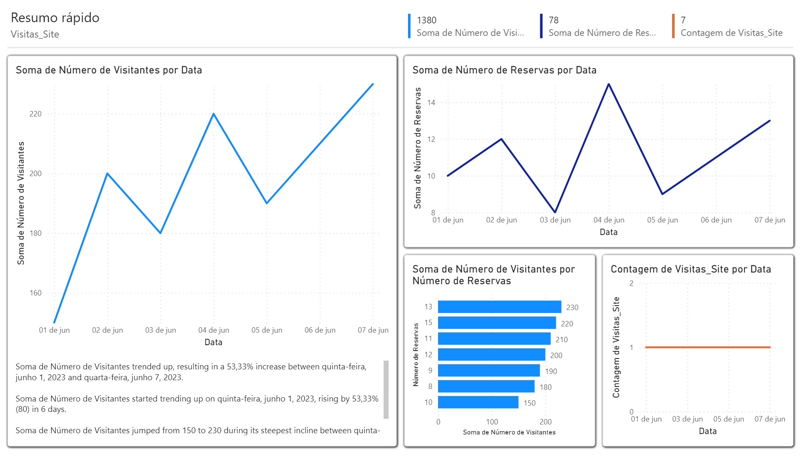

Esse gráfico representa exemplos de cancelamentos de reservas em um determinado período. Os dados incluem o número da reserva, a data em que o cancelamento foi feito e o motivo do cancelamento. Esses dados podem ser utilizados para análises e para identificar possíveis padrões ou razões comuns para o cancelamento de reservas.

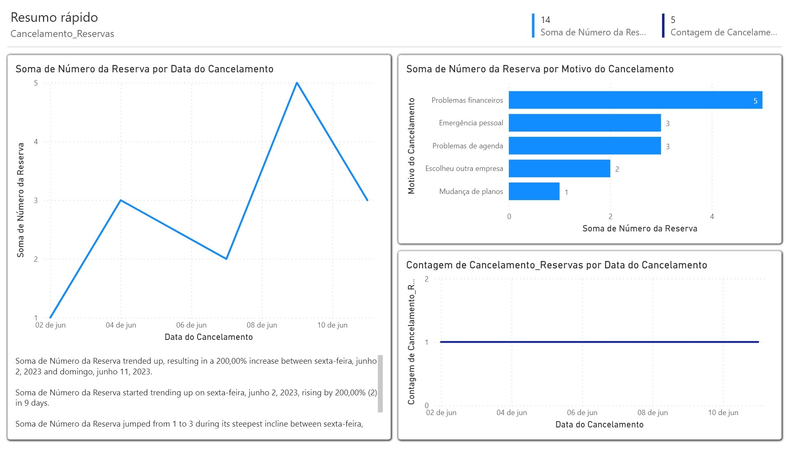

Esse gráfico representa um exemplo da quantidade de reservas feitas para retirada nos diferentes locais disponíveis. Os dados incluem o local de retirada e o número de reservas feitas para cada um desses locais. Essa informação é útil para acompanhar a demanda em cada local e tomar decisões estratégicas, como o gerenciamento adequado do estoque de veículos em cada localidade.

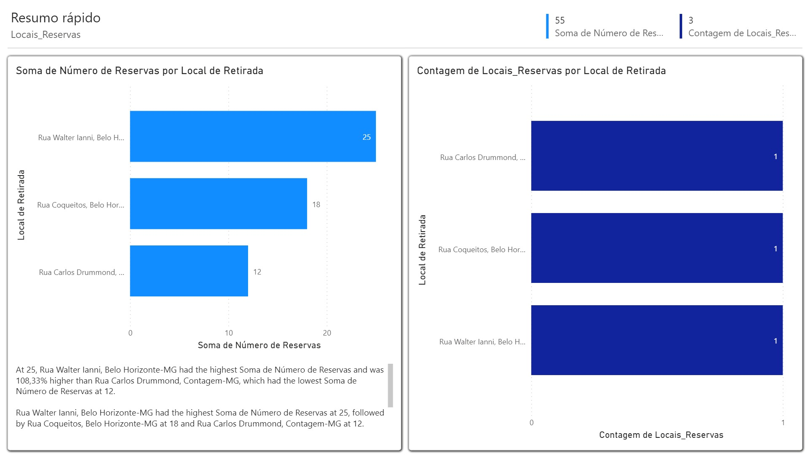

Esse gráfico representa um exemplo da quantidade de reservas feitas para cada um dos carros disponíveis. Os dados incluem a marca, nome do carro e o número de reservas feitas para cada modelo. Essa informação é útil para acompanhar a demanda por cada carro em particular e pode auxiliar na gestão do estoque e na tomada de decisões sobre a disponibilidade e a diversificação da frota. Lembre-se de adaptar essa tabela com os carros reais disponíveis em sua empresa de reserva de carros.

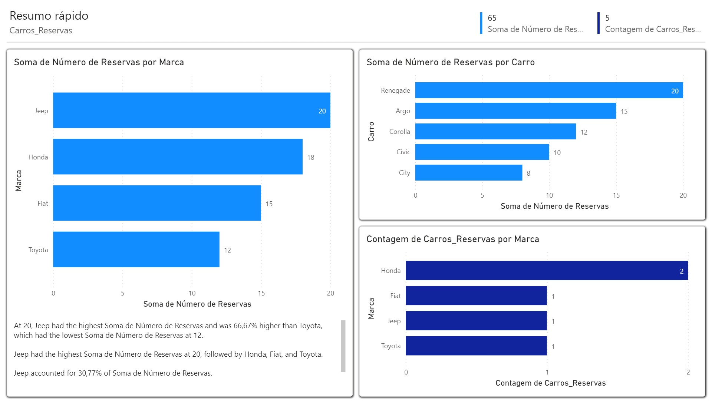

# Projeto da Solução

## Tecnologias Utilizadas

Para o front end utilizamos o framework bootstrap, bem como HTML,CSS e Javascript.
Já no backend utilizamos NodeJs para para configurar a api, criação de rotas. Utilizamos módulo express.
Nosso banco de dados foi o Microsoft SQL Server, usando pela interface do SQL Server Management Studio.
Como IDE utilizamos o Visual Studio Code e para controle de versão utilizamos Github no próprio VsCode por meio de extensão, facilitando assim os commits.

## Arquitetura da solução

A aplicação vai funcionar durante todo o fluxo do usuário se comunicando com o servidor e recebendo respostas do banco de dados, bem como incluindo novos dados.

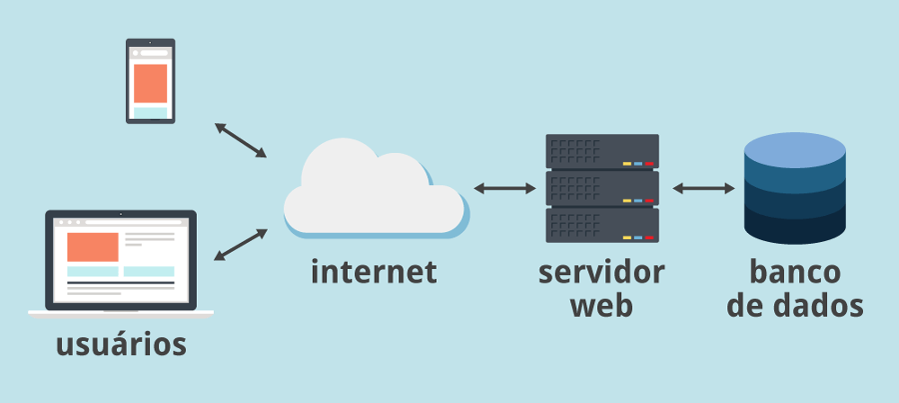

# Avaliação da Aplicação

#### 1. Teste de reserva bem-sucedida:

- Descrição: Verificar se um usuário pode fazer uma reserva de veículo de forma correta e obter uma confirmação.
	- Passos:
 	- 1.1 - Logar no sistema com as credenciais de usuário.
	- 1.2 - Navegar para a página de reserva de veículos.
	- 1.3 - Selecionar um veículo disponível na data desejada.
	- 1.4 - Confirmar a reserva.
	- 1.5 - Verificar se a reserva é registrada no sistema e o usuário recebe uma confirmação.

#### 2. Teste de disponibilidade de veículos:

- Descrição: Garantir que o sistema exiba apenas veículos disponíveis para reserva nas datas solicitadas.
	- Passos:
 	- 2.1 - Logar no sistema com as credenciais de usuário.
	- 2.2 - Navegar para a página de reserva de veículos.
	- 2.3 - Selecionar uma data de retirada.
	- 2.4 - Verificar se apenas os veículos disponíveis estão listados para seleção.
	- 2.5 - Verificar se a reserva é registrada no sistema e o usuário recebe uma confirmação.

 #### 3. Teste de validação de dados:

- Descrição: Validar se o sistema verifica e rejeita entradas inválidas ou inconsistentes durante o processo de reserva.
	- Passos:
 	- 3.1 - Logar no sistema com as credenciais de usuário.
	- 3.2 - Navegar para a página de reserva de veículos.
	- 3.3 - Tentar fazer uma reserva sem especificar a data de retirada.
	- 3.4 - Verificar se uma mensagem de erro é exibida solicitando que a data de retirada seja fornecida.
	

## Plano de Testes

#### 1. Cenários de Teste Selecionados:
- Teste de reserva bem-sucedida.
- Teste de disponibilidade de veículos.
- Teste de validação de dados.

#### 2. Funcionalidades Avaliadas:
- Reserva de veículos.
- Verificação de disponibilidade.
- Validação de dados de entrada.

#### 3. Grupo de Usuários:
- Próprios desenvolvedores.
- Familiares com conhecimento suficientes para realizar os testes.

## Registros de Testes

#### Pontos Fortes: 
- Reserva bem-sucedida: Os testes mostraram que a funcionalidade de reserva de veículos está funcionando corretamente. Os usuários conseguiram fazer reservas com sucesso, receberam confirmações e as reservas foram registradas corretamente no sistema.

- Verificação de disponibilidade: Os testes confirmaram que o sistema está exibindo apenas veículos disponíveis para as datas solicitadas. Os usuários foram capazes de selecionar veículos com base na disponibilidade adequada.

- Validação de dados: Foi constatado que o sistema realiza a validação correta dos dados de entrada durante o processo de reserva. Os usuários receberam mensagens de erro apropriadas quando tentaram inserir informações inválidas ou inconsistentes.

#### Pontos Fracos: 

- As reservas são até muito bem sucedidas, quero dizer, há necessidade de colocar um limitador de reservas, para que os usuários não possam fazer infinitas reservas, apesar de terem aceitado os termos e o cartão registrado para haver cobranças em casos desse tipo inclusive.

# Referências

Para Criar as rotas e conexão com banco de dados, utilizamos o arquivo deixado pelo professor no módulo como exemplo e também video explicando passo a passo:
- [Microsoft SQL Server & Nodejs REST API CRUD](https://www.youtube.com/watch?v=ReK0kscoF8o&t=43s)

Para utilizar bootstrap acessamos a documentação:
- [Bootstrap](https://getbootstrap.com/docs/5.3/getting-started/introduction/)

Relatório a partir do Overleaf:
- [Overleaf](https://www.overleaf.com/latex/templates/sbc-conferences-template/blbxwjwzdngr.pdf)

